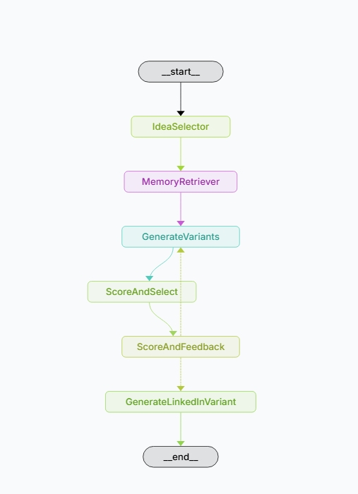

# 🤖 AI Content Agent

[](https://www.python.org/)
[](https://streamlit.io/)
[](https://github.com/langchain-ai/langgraph)
[](LICENSE)

---

## Overview

The **AI Content Agent** is a Streamlit-based app that helps you generate, score, and select high-performing social media content (tweets and LinkedIn posts) using LLMs like OpenAI GPT-4 and Gemini 1.5 Pro. It features trending topic inspiration, personality-driven prompt templates, token/cost tracking, and a beautiful chat UI.

---

## Features

- 🔍 **Fetch trending topics** from the web to inspire your content
- 🧠 **Generate multiple tweet & LinkedIn variants** for your selected theme
- 🤖 **Score and select the best idea** automatically using an LLM as judge
- ♻️ **Retry generation** until a high-quality result is found
- 🗃️ **Save top-performing posts** to a vector database
- 🧭 **Retrieve examples from memory** to guide future outputs
- 🎛️ **Customize model behavior** (LLM choice, temperature, tone)
- 💬 **Chat-like interface** with full conversation history
- 📊 **See token usage and cost** during each session

---

## Workflow Graph



### Node Descriptions (How the Agent Works)

- **IdeaSelector**: Receives your theme (topic) and refines it using an LLM to ensure it's clear, concise, and valuable for the target audience. If no theme is provided, a default is used.
- **MemoryRetriever**: Searches the vector database (ChromaDB) for top-performing tweets related to your theme, filtered by likes, and provides up to three for inspiration.
- **GenerateVariants**: The LLM generates three tweet variants using your theme, selected personality, and the retrieved top-performing examples.
- **ScoreAndSelect**: The LLM rates each variant on quality, relevance, engagement, clarity, and call-to-action. A composite score is calculated for each, and the best-scoring variant is selected automatically. The scores for the best variant are printed in the terminal for transparency.
- **ScoreAndFeedback**: Another LLM (the "judge") evaluates the selected tweet, scoring it from 0.0–1.0 and deciding if it should be 'approved' or retried. If not approved, the workflow loops back to generate new variants.
- **GenerateLinkedInVariant**: The best tweet is transformed into a LinkedIn post, tailored for the platform and audience, using the LLM and the same inspiration examples.
- **END**: The workflow finishes and results are displayed in the UI.


### Graph State Fields

The workflow state (`ContentState`) tracks all information as it moves through the graph:

- `theme`: The main topic or theme for content generation (refined by LLM).
- `variant_ideas`: List of generated tweet variants.
- `top_performers`: List of top-performing tweets retrieved from memory.
- `selected_idea`: The best tweet variant, selected by LLM-based scoring.
- `linkedin_variant`: The LinkedIn post generated from the best tweet.
- `user_feedback`: (Reserved for future use) User feedback on the result.
- `score`: The score assigned by the LLM judge (0.0–1.0).
- `status`: Whether the result is 'approved' or needs a 'retry'.
- `token_count`: Total tokens used in the workflow run (for cost tracking).
- `price_usd`: Estimated price in USD for the run.

---

## Installation

### 1. Clone the repository
```sh
git clone https://github.com/TuringCollegeSubmissions/mwange-AE.3.5.git
cd mwange-AE.3.5
```

### 2. Install dependencies (using pyproject.toml)
- **Recommended:**
  ```sh
  python -m pip install -e .
  ```

### 3. Set up environment variables
Create a `.env` file in the project root with your API keys:
```
OPENAI_API_KEY=sk-...
GOOGLE_API_KEY=your-gemini-key
```

---

## Usage

1. **Start the app:**
   ```sh
   streamlit run app.py
   ```
2. **Configure the agent** in the sidebar (personality, LLM, temperature, etc.)
3. **Pick a trending topic** or enter your own theme in the chat
4. **Review generated tweet and LinkedIn variants**
5. **Retry** if needed, or copy and post your favorite!

---

## Vector Store & Twitter Metrics

The agent uses a vector database (ChromaDB) to store and retrieve top-performing tweets for inspiration. In the future, this will be powered by real Twitter metrics (likes, retweets, etc.) fetched from your own tweet history. For now, a mock tweet history with embedded metrics is used to populate the vector store. The workflow retrieves the best examples by filtering for tweets with more than 30 likes, helping guide the LLM to generate higher-quality, more engaging content. Once real Twitter data is available, the agent can be extended to fetch and update these metrics automatically.

## Project Structure

---

```
├── app.py                # Main Streamlit app
├── src/
│   └── agent/
│       ├── graph.py      # LangGraph workflow
│       ├── prompts.py    # Prompt templates
│   └── ui/
│       ├── sidebar.py
│       ├── trending.py
│       ├── chat.py
│       └── token_counter.py
├── static/
│   └── graph.jpg         # Workflow graph image
├── build/
│   └── content_agent_graph.dot
├── requirements.txt
├── pyproject.toml
├── .env
└── README.md
```

---

## License

This project is licensed under the MIT License. See [LICENSE](LICENSE) for details.

---

## Acknowledgements
- [Streamlit](https://streamlit.io/)
- [LangGraph](https://github.com/langchain-ai/langgraph)
- [OpenAI](https://openai.com/)
- [Google Gemini](https://ai.google.dev/gemini-api)

---

*Made with ❤️ by Mario*
