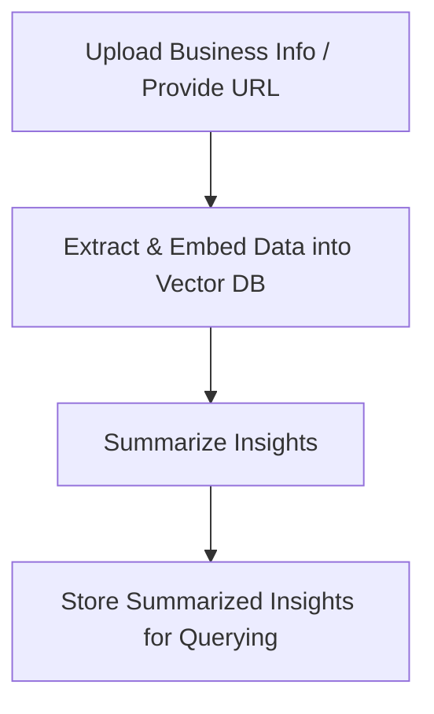
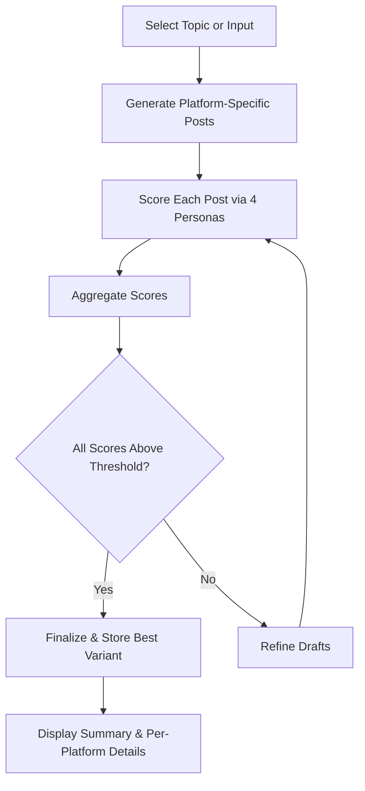
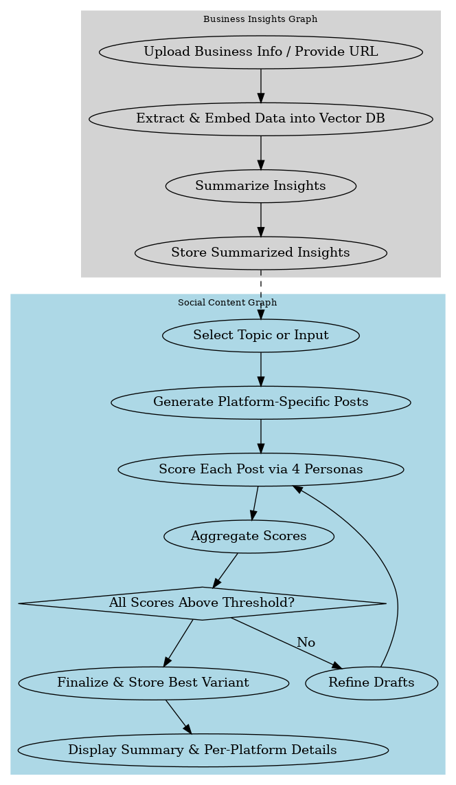
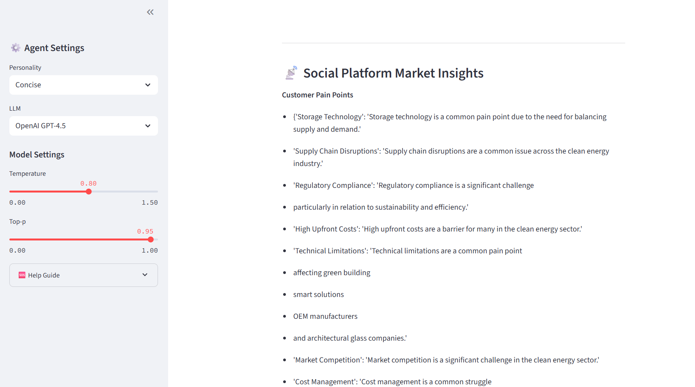
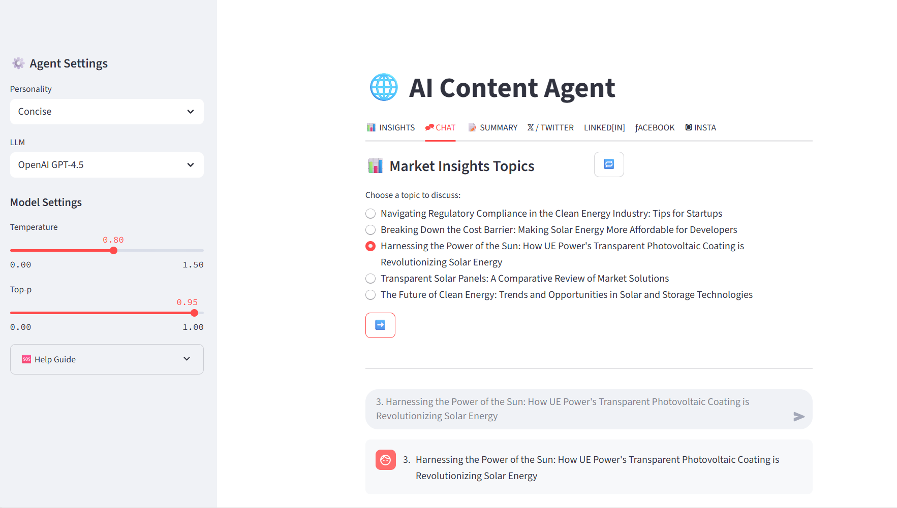
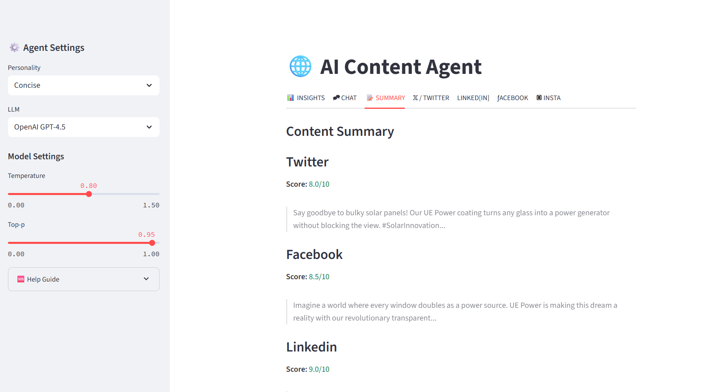
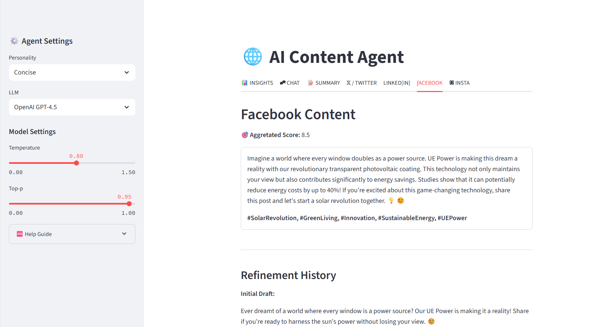

# PULSE


## Short
An AI-powered agentic application for **multi-platform content ideation, generation, scoring, and refinement**.  
The app uses **LangGraph** to orchestrate two main processes:  
1. **Business Insights Graph** – Summarizes uploaded business information and research market insights.  
2. **Social Content Graph** – Generates and refines social media posts around the brand and business insights for multiple platforms.

---

## Overview
This project is an AI-powered content creation agent designed to:

Generate platform-specific posts (Twitter, LinkedIn, Facebook, Instagram) from custom topics and brand insights.

Use multi-persona scoring loops (social strategist, industry expert, target customer, investor) to refine content until high quality.

Pull market insights from social platforms, combine them with business data, and suggest customized trending topics.

Display real-time progress during generation/refinement and summarize results in a clear UI.

---

## Core Features

- Upload **business info, your pitch deck or business plan as PDFs or text**, provide a **URL to your website or about page** to extract insights and summarize them.
- Generate **customized market insights** from social platform data (e.g. Twitter, Reddit, Quora or YCombinator), about common pain points, target group, industry trends, competition and user feedback.

- Create **platform-specific content** for:
  - Twitter (Short, viral hooks)
  - Facebook (community-oriented)
  - LinkedIn (professional/thought leadership)
  - Instagram (visual/meme-oriented)

- Scoring posts with **Multi-persona LLM-as-a-Judge** 
- Four personas score content:
  - Social media Strategist (clarity, virality, brand fit)
  - Target Customer (pain points, relatability)
  - Industry Expert (accuracy, authority)
  - Investor (business value, growth potential)
- **Iterative refinement loop** until a quality threshold is reached.
- Summarized **overview tab** + detailed per-platform tabs with refinment history for direct copy.
- Full **real-time status updates** during graph execution using stream.

---

## Architecture: Two Graphs Working Together

### 1. Business Insights Graph
- **Input:** Uploaded business documents and/or provide URL.
- **Steps:**
  1. Extract and embed raw business data into vector DB.
  2. Summarize insights for later use in content generation.
  3. Store summarized insights for querying.

**Purpose:** Provides contextual knowledge for the Social Content Graph.


```mermaid
flowchart TD
    A[Upload Business Info / Provide URL] --> B[Extract & Embed Data into Vector DB]
    B --> C[Summarize Insights]
    C --> D[Store Summarized Insights for Querying]
```

### 2. Social Content Graph
- **Input:** Selected topic or user input + summarized insights.
- **Steps:**
  1. Generate 4 platform-specific posts in a single LLM call (JSON output).
  2. Score each post via 4 personas (16 judgments total).
  3. Aggregate scores; trigger refinement loop if below threshold.
  4. Store refined drafts in history and finalize best variant.
  5. Display summary + detailed breakdown per platform.


```mermaid
flowchart TD
    A[Select Topic or Input] --> B[Generate Platform-Specific Posts]
    B --> C[Score Each Post via 4 Personas]
    C --> D[Aggregate Scores]
    D --> E{All Scores Above Threshold?}
    E -- Yes --> F[Finalize & Store Best Variant]
    E -- No --> G[Refine Drafts]
    G --> C
    F --> H[Display Summary & Per-Platform Details]
```

## Architecture Diagram


---

## Installation

```bash
git clone <https://github.com/daytona675r/ContentAgent>
cd ContentAgent
python3 -m venv venv
pip install 
```

**Environment variables (set in `.env`):**
```
OPENAI_API_KEY=your-key
GOOGLE_API_KEY=your-key
TAVILY_API_KEY=your-key for researching insights
```

---

## Running the App

```bash
streamlit run app.py
```

---


## Usage Guide

1. **Upload Business Info**  
   Go to the Insights tab and upload PDFs or text describing your company.
   Provide a link to your product website or about page.  
   The system summarizes and stores this in the vector DB.

2. **Generate Market Insights**  
   Then the Insights Graph is triggered to analyze trends and store structured insights.

3. **Select or Input Topic**  
   In the Chat tab pick from generated topics based around your business or enter your own.

4. **Generate Content**  
   The Social Content Graph creates posts for Twitter, Facebook, LinkedIn, and Instagram.

5. **Scoring & Refinement**  
   A Multi-persona judging loop refines until acceptable scores are reached.

6. **View Results**  
   The Summary tab gives an overview; the detailed tabs show full drafts to copy and the refinement history together with scores.

---

## Badges & Tech

- **LLM Orchestration:** LangGraph
- **Frontend:** Streamlit
- **Storage:** Vector DB (Chroma)
- **Evaluation:** LLM-as-a-Judge with multi-persona perspectives
- **LLMs:** OpenAI GPT models (gpt-4 for generation/scoring, gpt-3.5 optional for cheaper tasks, Gemini)

---

## App Screenshots





---

## License

MIT License. See LICENSE for details.
